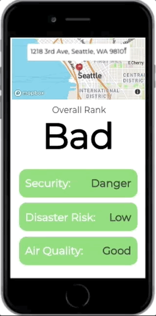

# Safe Street

Safe Street is a mobile end app prototype to help house buyer, renter or visitor know a neighborhood in a fast and comprehensive way. It provides info regarding air quality, security and disaster risk in the neighborhood searched by user.

**Tech:** Javascript, React, React Map GL, Node/Express, JWT, NoSQL/MongoDB, OpenFEMA API, World Air Quality Index API, City of Seattle Open Data Portal

This is a two-day Hackathon Project with *[Roy Daly](https://github.com/roydaly)* and *[Sameul Belete](https://github.com/Ethiotechguru)*.

## Table of Contents
* [Preview](#Preview)
* [Design](#Design)
* [Development](#Development)
* [References](#References)

## Preview

| Login with JWT | Search and overall score |------------------------------------------------ |
|:---:|:---:|:----:|
| |  | |

| Security detail | Disaster detail | Air quality detail |
|:---:|:---:|:----:|
| |  |  |

## Design
Safe Street is desgined to provide info about a neighborhood that 
can be overlooked by travelers, house buyers and visitor. For example, the deadly landslide happened 5 years ago in Oso, WA. It destroyed a huge amount of houses. If there is an easy access for these datas, users can be more prepared and avoid risks. As a prototype, Safe Street is aimed to demostrate this concept.

### Features
* Search by address
* Overall rate for the area.
* Detailed info for each aspect (security, disaster and air quality)

For the full app, features like warning notice, neighborhood comparison and recommendations will be included in future.


**React Map GL**
Map and location display feature is implemented by [React Map GL](https://uber.github.io/react-map-gl/#/). React Map GL is a React Component created by uber based on mapbox. After getting the location detail (/api/address) by mapbox at backend:
```javascript
// src/router/api.js
const geocodingClient = mapbox({
    accessToken: process.env.MAPBOX_PUBLIC_KEY
});

// get /api/address?address=   query
router.get('/address', (req, res) => {
  let address = req.query.address;
  console.log('address is ', address);
  geocodingClient.forwardGeocode({
    query: address 
  }).send().then(function(response) {
    let result = {
      center: response.body.features[0].center,
      neighborhood: response.body.features[0].context[0].text,
      zipcode: response.body.features[0].context[1].text,
      city: response.body.features[0].context[2].text,
      state: response.body.features[0].context[3].short_code.substring(3)  
    }
    console.log(result);
    res.json(result)
})
})
```
The detail info was then used to get security, nature disaster, air quality as well as data for React Map GL

```jsx
import ReactMapGL, {Marker, Popup} from 'react-map-gl';

class Map extends React.Component {
  constructor(props) {
    super(props);
    this.state = {
      //data for mapbox
      viewport: {
        width: 375,
        height: 200,
        latitude: props.center[1],
        longitude: props.center[0],
        zoom: 12,
      },
      showPopup: true
    }
  }

  render() {
    const {showPopup} = this.state;
    return(
      <ReactMapGL
        {...this.state.viewport}
        onViewportChange={(viewport) => this.setState({viewport})}
        mapboxApiAccessToken={TOKEN}
        mapStyle='mapbox://styles/mapbox/streets-v9'>
          <Marker latitude={this.props.center[1]}
                  longitude={this.props.center[0]}
                  offsetLeft={-20} 
                  offsetTop={-10}
                  >
            <div className="marker" onClick={() => this.setState({showPopup: true})}>📍</div>
          </Marker>
          {showPopup && <Popup
          latitude={this.props.center[1]}
          longitude={this.props.center[0]}
          closeButton={true}
          closeOnClick={false}
          onClose={() => this.setState({showPopup: false})}
          anchor="bottom-left" >
          <div className='map-popup'>{this.props.address}</div>
        </Popup>}
        </ReactMapGL>
    );
  }
}

export default Map;

```
**Resful Route**

| Routes | Methods | Notes |
|:------:|:-------:|:-----:|
| /api/address | GET | get detailed info of input address |
| /api/disasters | GET | get and sort nature desaster history for location |
| /api/airquality | GET | get air quality index for neighborhood |
| /api/crime | GET | get and sort crimes history for neighborhood |

## References
* **[OpenFEMA API](https://www.fema.gov/openfema-api-documentation)**: nature disaster record.
* **[WAQI API](https://waqi.info)**: for world-wide air quality data.
* **[City of Seattle Open Data Portal](https://data.seattle.gov)**: for crimal record.
* **[React Map GL](https://uber.github.io/react-map-gl/#/)**: for map generation and location display. 
* **[Stack Overflow](https://stackoverflow.com/)**: for quesionts and errors.
* **[W3School](https://www.w3schools.com/)**: for CSS, HTML and Javascript documents.